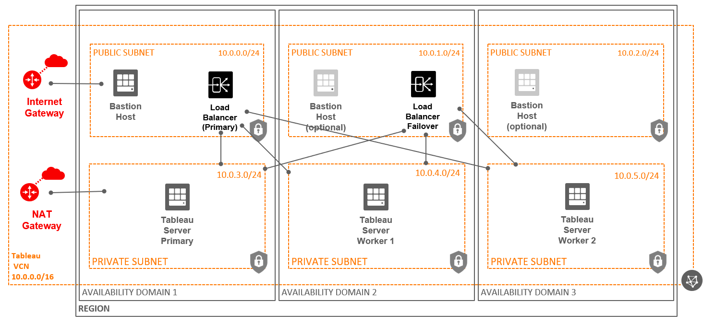
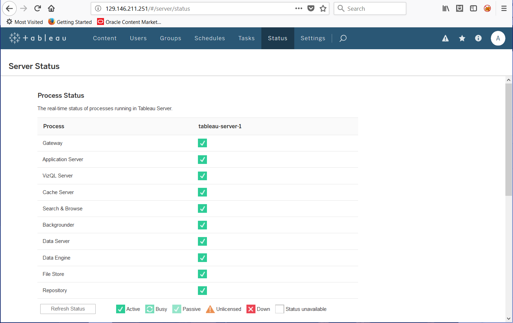
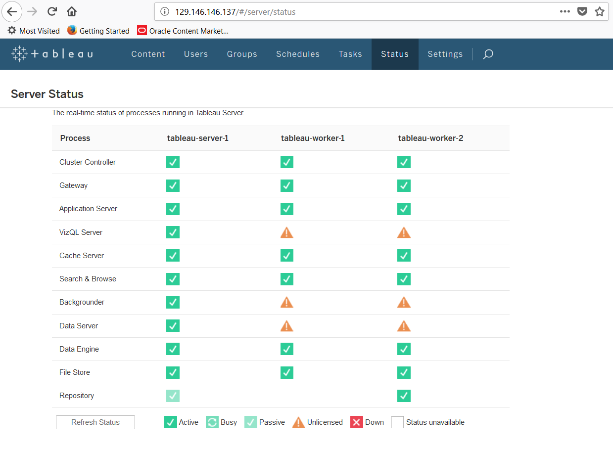
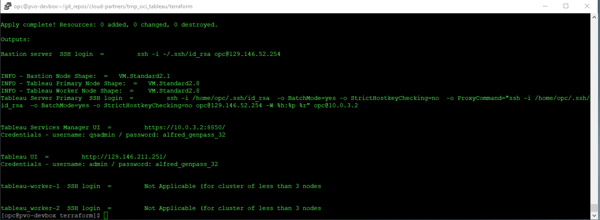
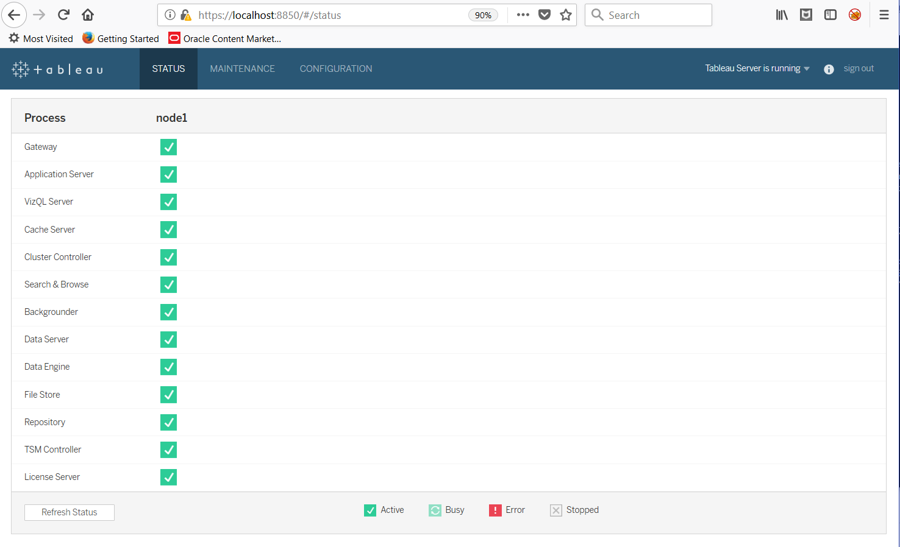
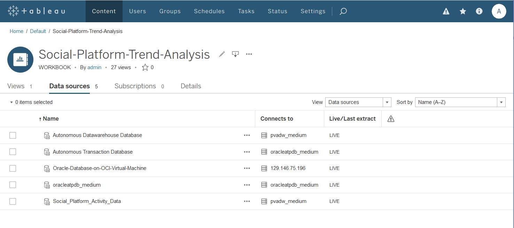

# oci-tableau
This Quick Start helps you deploy a fully functional Tableau Server environment on Oracle Cloud Infrastructure (OCI).

# High Level Architecture
The Quick Start uses Hashicorp Terraform templates to automatically deploy a standalone or cluster (distributed) architecture for Tableau Server into a new private virtual cloud network (VCN) in your OCI tenancy/account.  You can use any OCI Compute shapes (Baremetal or Virtual machine), block storage or local NVMe to store Tableau data. This template will pre-install Oracle Instant Client  and Tableau Oracle driver for Oracle database and auto-configures tableau servers with Oracle Credentials Wallet file to integrate with Oracle Autonomous DataWarehouse (ADW),  Oracle Autonomous Transaction Processing (ATP) databases running on OCI. 

## Tableau Trial license (default)
By default, the template uses a trial license of Tableau which is valid only for 1 instance.  The template allows you to pass your purchased license key.  Using this template, you can still create a 3 or more node cluster (distributed) architecture for Tableau Server, but some of the Tableau services on tableau-worker-n nodes will not be available if you use trial license. (see below Multi-Node-Tableau-Status view for which services will be available on tableau-worker-n nodes. 

## Single Node Tableau Services Status

## Multi Node Tableau Status 

## Prerequisites
In addition to an active tenancy on OCI, you will need a functional installation of Terraform, and an API key for a privileged user in the tenancy.  See these documentation links for more information:

[Getting Started with Terraform on OCI](https://docs.cloud.oracle.com/iaas/Content/API/SDKDocs/terraformgetstarted.htm)

[How to Generate an API Signing Key](https://docs.cloud.oracle.com/iaas/Content/API/Concepts/apisigningkey.htm#How)

Once the pre-requisites are in place, you will need to copy the templates from this repository to where you have Terraform installed.

## Clone the Terraform template
Now, you'll want a local copy of this repo.  You can make that with the commands:

    git clone https://github.com/pvaldria/oci-tableau.git
    cd oci-tableau
    ls

## Update Template Configuration
Update environment variables in config file: [env-vars](https://github.com/pvaldria/oci-tableau/blob/master/env-vars)  to specify your OCI account details like tenancy_ocid, user_ocid, compartment_ocid and source this file prior to installation, either reference it in your .rc file for your shell's or run the following:

        source env-vars

## Update variables.tf file (optional)
This is optional, but you can update the variables.tf to change compute shapes to use for Tableau servers (primary and worker nodes), # of worker nodes, block storage size per node and various other Tableau specific values like Tableau Server version, login credentials and registration details.  Also you can specify "oracle_credentials_wallet_zip_path" to pre-configure servers to integrate with Oracle Autonomous DataWarehouse (ADW),  Oracle Autonomous Transaction Processing (ATP) databases. 

## Deployment & Post Deployment

Deploy using standard Terraform commands

        terraform init && terraform plan && terraform apply

## Terraform apply - output 

## Tableau Services Manager UI

## Tableau Workbook View

## Integration with Oracle database, Oracle Autonomous DataWarehouse (ADW),  Oracle Autonomous Transaction Processing (ATP) database. 
This template will pre-install Oracle Instant Client  and Tableau Oracle driver for Oracle database and auto-configures tableau servers with Oracle Credentials Wallet file to integrate with Oracle Autonomous DataWarehouse (ADW),  Oracle Autonomous Transaction Processing (ATP) databases running on OCI. 

As part of setup, it will update /var/opt/tableau/tableau_server/.local/share/systemd/user/tabsvc_0.service to include Oracle credential wallet info and restart "tabsvc_0" services. 

